# github-actions-tutorial
Aprendiendo GitHub Actions

## hello.yml
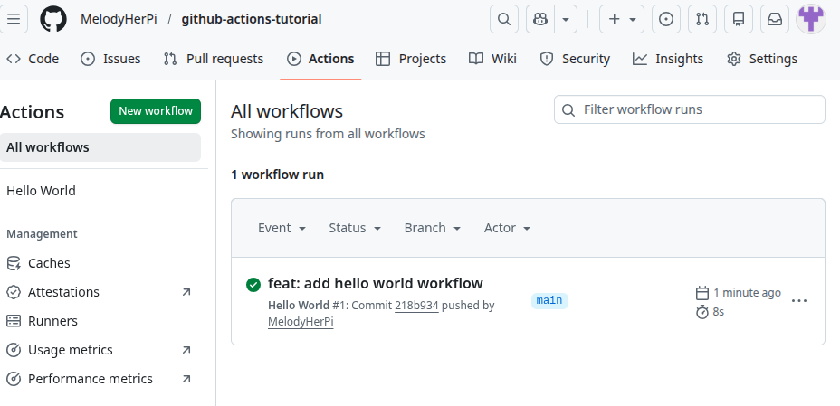

## show-code.yml
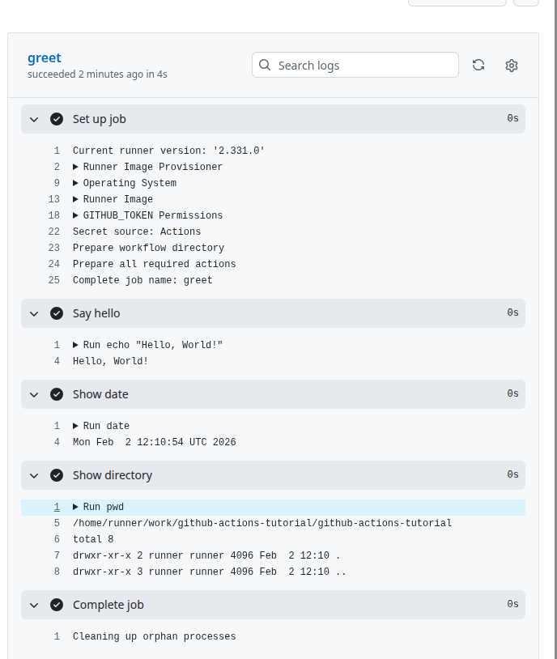
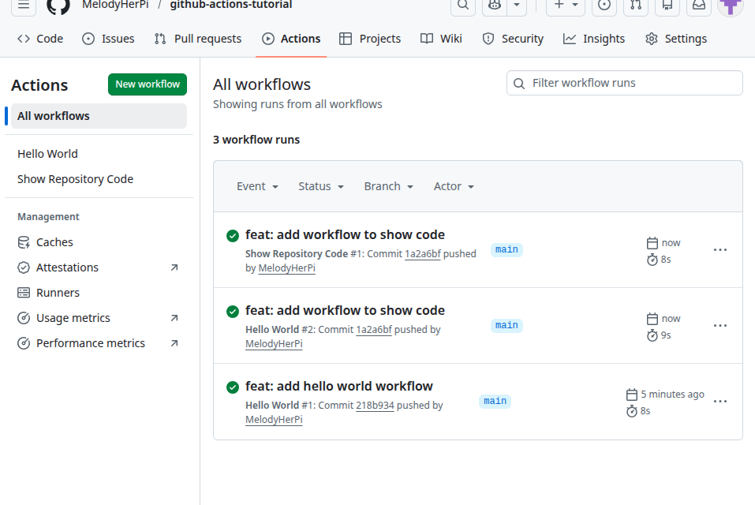

> Hice mal el push, por lo que tuve que repetirlo: 

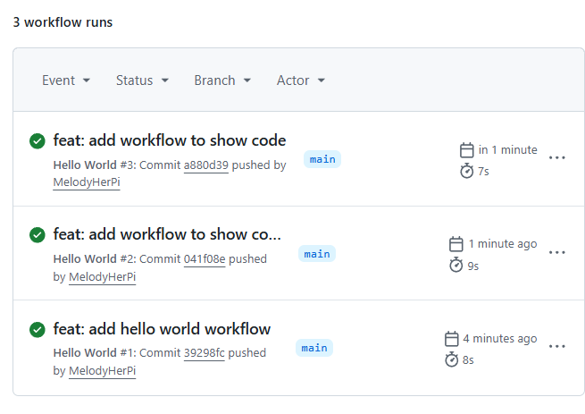
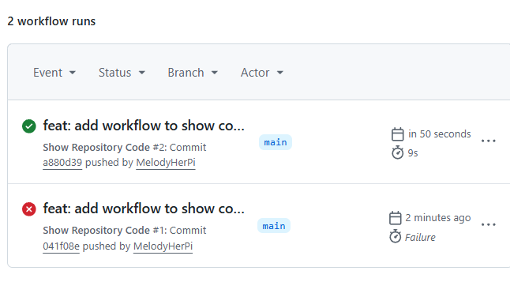

## only-main.yml
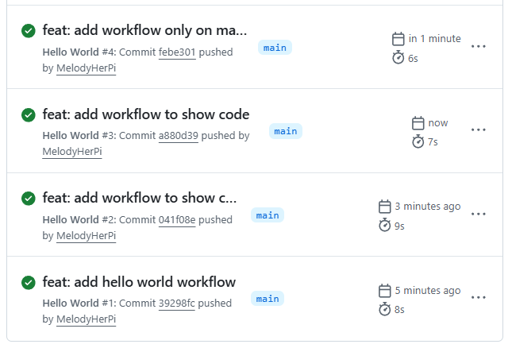

## pr-check.yml
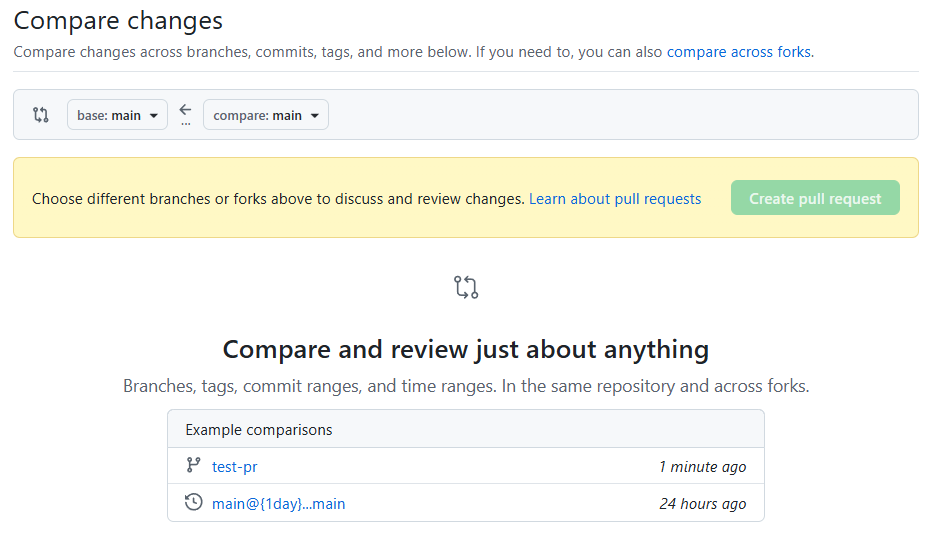
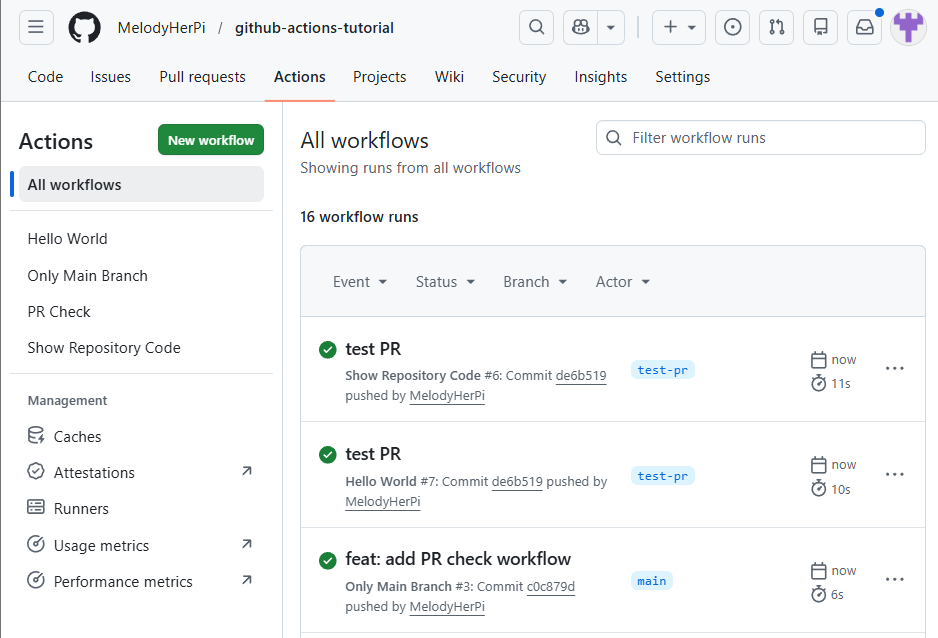

## multi-job.yml
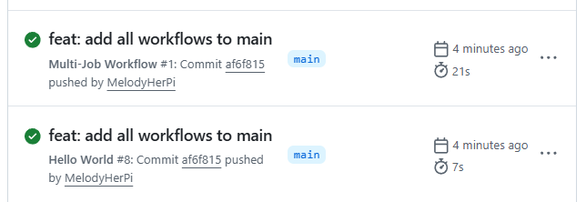
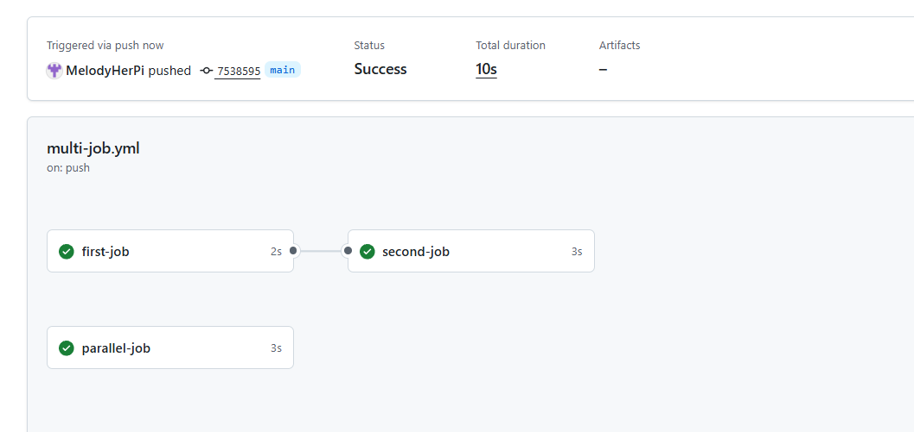

## env-vars.yml
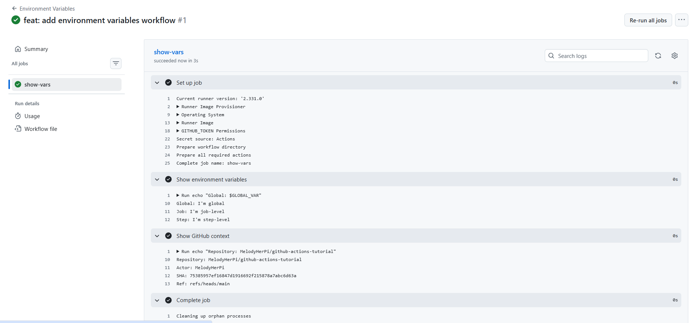

## conditionals.yml
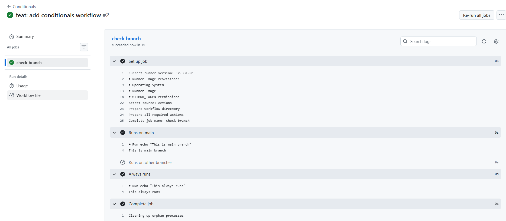

## matrix.yml
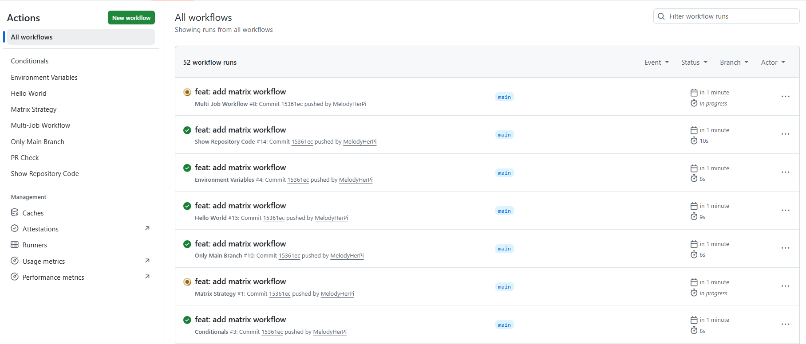

## matrix-exclude.yml
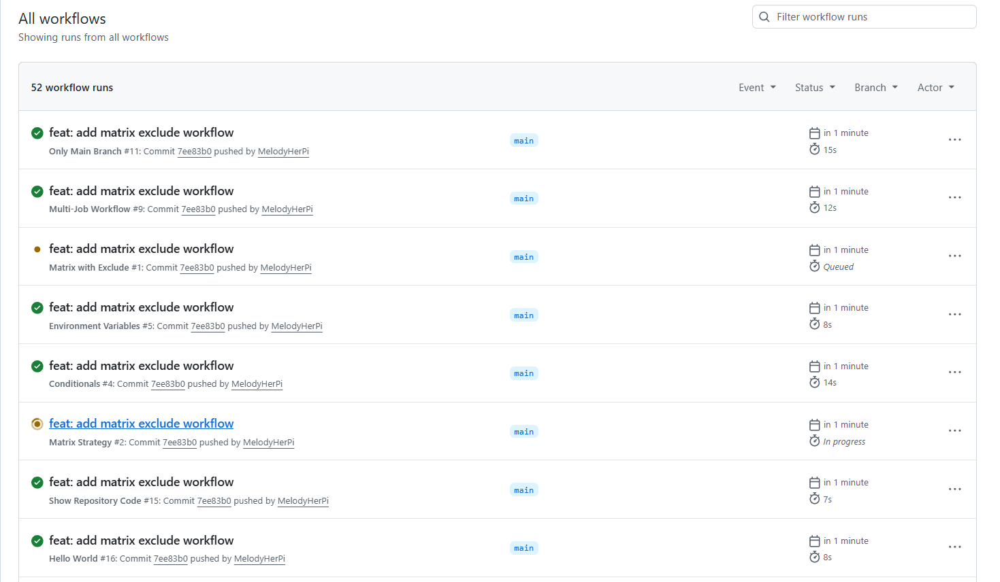

## matrix-include.yml
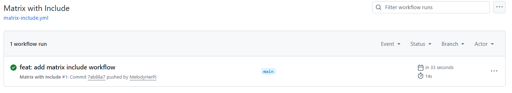

## matrix-fail-fast.yml
> En esta parte, en principio debería darme error, cosa que no pasó ya que todo me marcaba que estaba bien
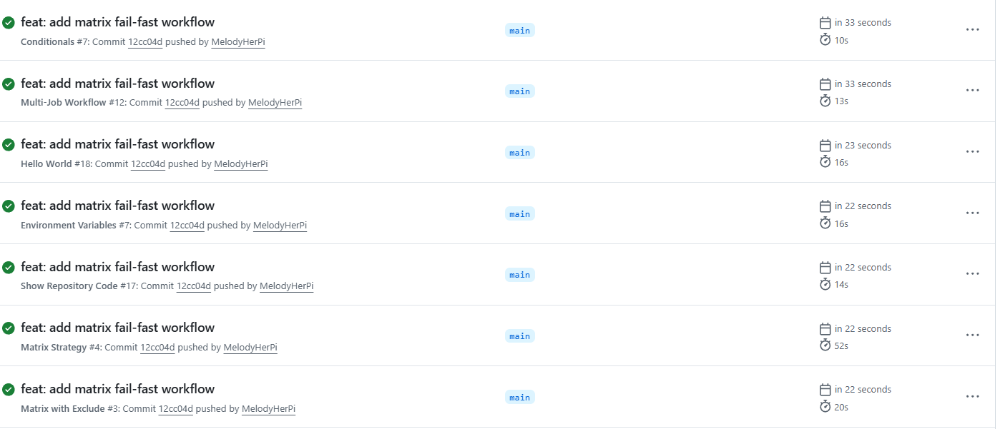

## Ejercicios
### motivational-monday-yml
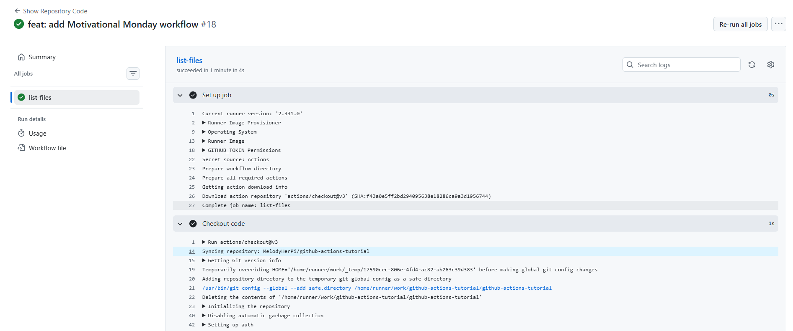
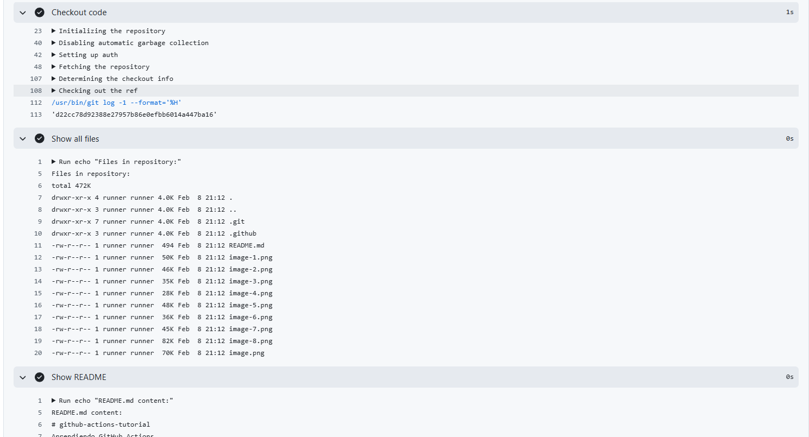
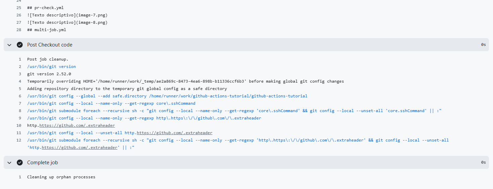

> Lo ejecuté manualmente en el git actions

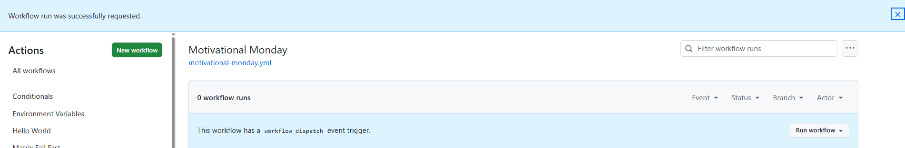
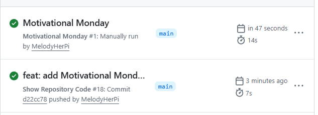

### calculator.yml
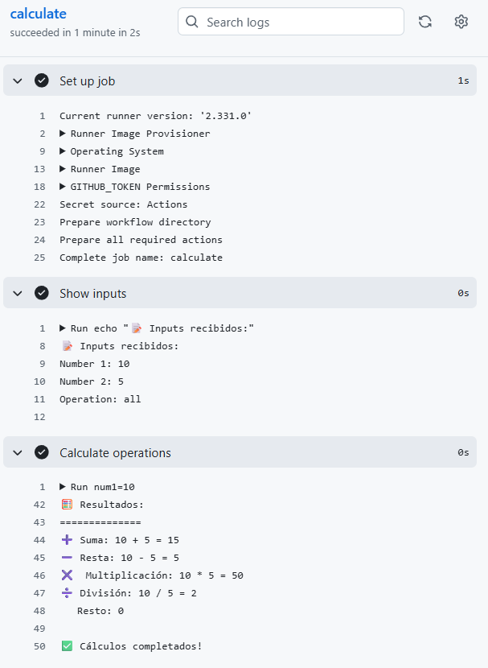

### multi-os-test.yml
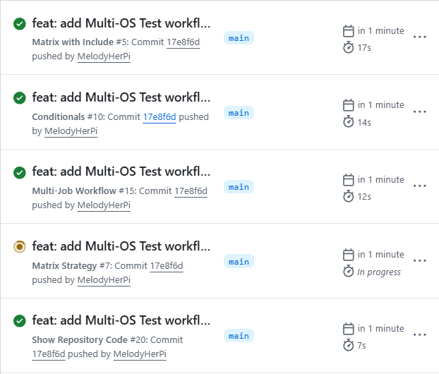

